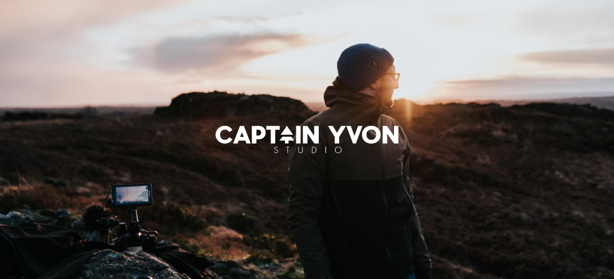

#### Hello !

Moi c’est Grégory et je vis dans le Finistère Nord avec ma famille.

Allez savoir pourquoi, mais je suis attiré par la mer depuis mon plus jeune âge. Voile, bodyboard, kitesurf, surf… Plus les années passent, plus ce besoin d'aller à l'eau est présent, même si ma pratique évolue. En ce moment, mon truc, c'est le bodysurf en complément des [watershots](https://gregorymignard.com/watershot/). Je trouve que ça se complète parfaitement et j'adore cette approche minimaliste et primitive du surf.


  
  


Voilà maintenant 4 ans que je traine en van avec ma famille ou par moment en mode *studio mobile* pour réaliser quelques projets vidéos. J’aime beaucoup cette façon minimaliste de voyager et de se connecter à la nature. Mes enfants aussi adorent et c’est toujours un plaisir d’organiser une petite virée à quelques kilomètres de la maison comme un projet de voyage un peu plus loin. J’essaye aussi d’être une meilleure personne chaque jour et de montrer le bon exemple à mes enfants. Je suis assez sensible aux problèmes environnementaux et j’essaye autant que possible de faire ma part dans ma vie de tous les jours, dans ma consommation, mais aussi en prenant le temps de réaliser et partager des sujets qui me tiennent à cœur et qui, je l’espère, peuvent inspirer d’autres personnes à emboiter le pas. Je suis d'ailleurs ambassadeur du programme [Outdoor Sentinel](https://www.lafuma.com/fr/outdoor-sentinels) de la marque Lafuma avec qui je partage cette vision de l'activisme en contribuant à différents projets liés à l'environnement.

En 2016, j'ai co-fondé [Captain Yvon Studio](https://captainyvon.fr) avec [Jérémy](http://jeremyjanin.com/), un studio de production spécialisée dans la création de photo et de films d’aventure, voyage et sports outdoor. On essaye de raconter de belles histoires et de documenter des trucs authentiques qui nous sont chers. Depuis 2021, je suis membre du collectif [1% for the Planet](https://www.onepercentfortheplanet.fr/) en reversant une partie de mon chiffre d'affaire au profit d’associations environnementales.

> Pour les demandes de prestations (reportage, réalisation de vidéo, etc.), merci de m’envoyer un mail à cette adresse : [studio@captainyvon.fr](studio@captainyvon.fr).  
> Si vous voulez me suivre de plus près ou juste papoter, n’hésitez pas à le faire via [Twitter](https://twitter.com/gregmignard), [Instagram](https://www.instagram.com/gregmignard/) ou bien un petit mot à [greg@gregorymignard.com](greg@gregorymignard.com).

Totalement amoureux de la vidéo, j'ai passé beaucoup de temps à peaufiner [mon setup](https://gregorymignard.com/equipement/) pour obtenir quelque chose de versatile et performant. Je ne suis pas dans la course au matériel dernier cri, je préfère vraiment optimiser ce setup pour avoir quelque chose qui correspond à mes besoins tout en prenant du plaisir à l'utiliser.  
J'ai plus récemment repris le chemin de [l’argentique](https://gregorymignard.com/analog/) pour la photo et le format me plait vraiment. J'ai retrouvé mon vieux Nikon FM2 que j'ai rapidement complété d'un petit point & shoot [Olympus XA](https://gregorymignard.com/olympus-xa/) que j’emmène partout avec moi. Pour le moyen format, j'ai chiné un magnifique Fuji GW690iii et pour combler ma passion de l'océan, j'ai craqué pour un un [Nikonos V](https://gregorymignard.com/nikonos-v/), un boitier que je convoitais depuis très longtemps.  
Je les utilise essentiellement avec de la Portra 400, Portra 800 et de la Ektar 100. Je me suis même récemment offert une caméra Super 8, une Canon 312XL-S que je compte utiliser avec de la Kodak Vision 3 50D.

***

*C’est la version 2021.06.14 de cette page Now. Si tu veux en savoir plus sur la page /now, [vas donc voir par ici](https://nownownow.com/about).*

<form style="max-width: 57rem!important; background-color: #F3F3F3;border:1px solid #F3F3F3;padding:24px;text-align:center;" action="https://tinyletter.com/captainyvon" method="post" target="popupwindow" onsubmit="window.open('https://tinyletter.com/captainyvon', 'popupwindow', 'scrollbars=yes,width=800,height=600');return true">
<label for="tlemail"><h3>Outline, la lettre</h3> Si tu aimes ce que j’écris ici, alors je t’invite à t’abonner à Outline, ma newsletter 📝.</label>

<input type="text" style="width:320px" name="email" id="tlemail" />
<input type="hidden" value="1" name="embed"/><input class="button" type="submit" value="S'abonner" /></form>
