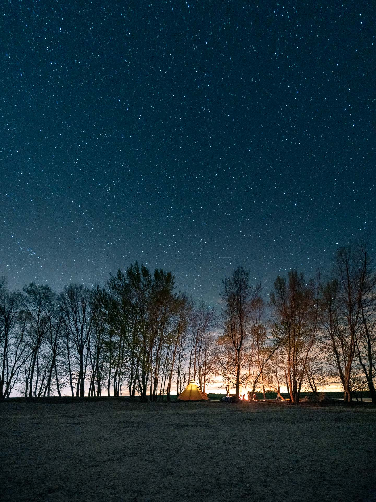

Vendredi 5 avril, 9h30, je gare [Yvon](https://www.instagram.com/lifewithyvon/) sur le parking de la BioCoop, c'est ici que je dois récupérer [Yannick](https://vadrouilles.co/bivouac-et-canoe/), notre covoitureur et aventurier du weekend. La route est longue pour rejoindre la Sologne, la terre de mon enfance où je retrouve mes parents le temps de déposer Coline et Marion pendant que je serais en stage photo d'aventure avec Yannick... Entre autre.
La première étape est de retrouver [Jeremy](https://djisupertramp.com/) à la gare des Aubrais et de trouver un spot sympa pour se poser en van pour la soirée et la nuit.




  
  


Le hasard nous emmène au bord d'un étang au coeur de la forêt Orléanaise, le spot parfait pour profiter d'une belle lumière et déguster les pizzas achetées un peu plus tôt sur la route.

***

Samedi 6 avril, voilà la fameuse date que j'attendais avec impatience, la date de mon workshop Captain Yvon organisé avec Jeremy. Le rendez-vous est donné à [la base de Joris](https://www.destinationh2o.fr/), notre guide canoë pour les prochaines 24 heures. Si [Yannick](https://www.instagram.com/vadrouilles.co/) est déjà de la partie depuis la veille, il sera rejoint par [Aurélie](https://www.instagram.com/aurel_baroude/), [Lucie](https://www.instagram.com/lulujzzz/), Alexandre, Charlène et Gaël, nos apprentis du weekend.

Après notre brief et celui de Joris, nous voici à embarquer deux par deux dans de véritables canoës canadiens avec tout le matériel nécessaire à cette aventure.


  
  



  
  


> Moi qui ai pour habitude de voyager léger, je dois avouer que la charge utile de 300kg, ça permet de ne pas se priver et d’envisager des bivouacs tout confort.

Une fois sur la Loire, nous nous laissons de suite aller au rythme du fleuve, en donnant quelques coups de pagaies, en s’arrêtant de temps en temps pour réaliser des images avec le groupe et observer les traces de castors qui façonnent les rives de la Loire.




  
  
  


En fin de journée, nous repérons une île sur laquelle nous établirons notre camp. Trouver du bois, faire un feu, monter le tipi... Tout le monde participe naturellement et l’organisation se met en place.
L’heure bleue arrive, nous profitons de ces quelques précieuses minutes pour enseigner nos techniques en basse lumière et profiter de cette ambiance toute particulière.


  
  
  



  
  
  


La nuit tombée, nous nous réunissons tous autour du feu pour déguster le repas préparé sur le feu par Joris et débattre autour de nos passions communes, la photographie et la nature.

La fatigue se fera sentir et nous nous coucherons tous sans mal dans ce magnifique tipi.

Au petit matin, ce sont ceux qui avaient les sacs de couchage les moins chauds qui mettent le nez dehors avec le projet d’allumer un feu. Ce qui s’avèrera fort agréable pour les autres au réveil et qui servira à faire chauffer l’eau pour le petit déjeuner.

Une fois le camp plié et nettoyé pour ne laisser aucune trace de notre passage, nous voici de nouveau à bord de nos canoë pour les dernières heures de notre microaventure.
Nous explorerons chaque berge intéressante jusqu’à notre point de chute à Châteauneuf-sur-Loire qui annoncera la fin de ce workshop passionnant !


  
  



  
  
  


Une fois de plus, pas besoin de partir bien loin pour se déconnecter et vivre des aventures.

***

Une vidéo devrait suivre prochainement sur cet article ! À bientôt :-)
