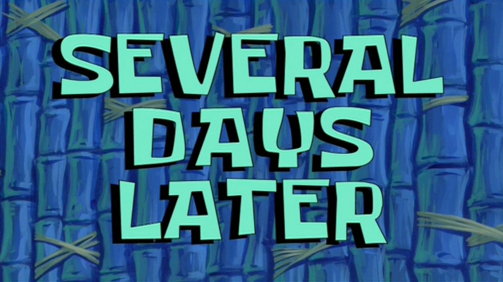

Depuis quelque temps, mon frigo héberge quelques péloches. Ça faisait pas mal de temps qu’il n’en avait pas vu, depuis pas loin de 10 ans je pense. À l’époque, on croisait encore des hipsters en fixie dans la rue et il y avait un gros engouement pour la photo argentique à base d’appareil vintage et de pellicules exotiques comme les Lomo.  
En ce temps, j’ai testé quelques vieux appareils chinés à droite et à gauche, pas forcément en bon état, j’y ai mis de la pellicule périmée ou à effet, comme ça se faisait beaucoup à l’époque et j’ai négligé le développement et la numérisation de mes clichés. Autant dire que je n’ai jamais été très emballé par ce que j’ai pu produire en argentique, rien de bien encourageant pour une pratique que j’ai finalement réservée qu’à de rares occasions.

Un jour, j’ai quand même investit dans un [Nikon FM2](https://www.danstacuve.org/test-nikon-fm2/) en super état, un boitier qui me faisait de l’œil et sur lequel j’utilise un 35mm f/2 et un 50mm f/1.8 que j’ai conservé de l’époque où j’étais chez Nikon. J’ai bien shooté quelques pellicules avec, mais toujours avec ces vieux films périmés et aux rendux bizarres ! Inutile de dire que je n’étais pas plus emballé que cela. Pourtant, je vois plein de photographes pratiquer régulièrement la photo argentique avec de sublimes résultats. [Joe Greer](https://www.instagram.com/ioegreer/), [Forrest Mankins](https://www.instagram.com/forrestmankins/), [Alex Hinson](https://www.instagram.com/alexxhinson), [Brooks Sterling](https://saltwater-magazine.com/articles//lens-brooks-sterling), [Hiroshi Masuko](https://www.instagram.com/hiroshimasukophotos/) ou tout simplement le hashtag [#negativemag](https://www.instagram.com/negativemag/)… Autant d’images et de créateurs qui me prouvent que l’argentique est une pratique à part entière, un choix d’appareil photo comme un autre et qu’il est possible de réaliser de belles choses !  
Ce constat aura été un déclic de mon côté. Je réalise enfin que je n’ai jamais réellement donné sa chance au FM2, jamais je ne lui ai chargé de bon film, jamais je ne l’ai utilisé dans de belles conditions de lumières, jamais je n’ai pris la peine de chercher un bon labo pour faire développer mes images ! Pour la première fois, je constate qu’il n’y a pas le numérique et l’argentique, mais qu’il y a tout simplement la photographie, peu importe l’appareil utilisé ! L’envie étant revenue, j’ai donc commandé un [pack de 5 Kodak Portra 400](https://www.digit-photo.com/KODAK-Portra-400-135-36-Poses-X5-rKFILM386.html?dpa_id=23), j’ai dépoussiéré et entretenu le FM2 et j’ai profité d’un tournage pour l’emmener avec moi avec l’idée de shooter deux pellicules.

Sur le papier, tout va bien, je pense avoir de bonnes images, mais est-ce que le FM2 fonctionne réellement bien ? Est-ce que j’ai fait des erreurs de débutants ? Honnêtement, le doute est encore là, car à l’heure où j’écris ces lignes, mes deux Portra 400 se dirigent vers le labo de [Nation Photo](https://www.nationphoto.com/) afin de se faire développer. Afin de m’occuper durant cette attente, j’ai changé les mousses du FM2 afin de le rendre encore plus fonctionnel et j’ai même craqué sur un petit Olympus XA que j’ai chiné après vu [celui de mon pote Yannick](https://yannickschutz.com/olympus-xa/) !

***

Enfin l’heure de vérité ! J’ai reçu mes négatifs développés et scannés et voici une sélection issue de ces deux Kodak Portra 400 avec le Nikon FM2 et son 35mm f/1.8.






  
  
  


  
  
  


Je réalise qu’il se sera écoulé pas loin d’un mois entre le moment où j’ai déclenché la première pose et aujourd’hui où je (re)découvre ces images. Cette attente forcée renforce la valeur d’un cliché et motive à déclencher encore mieux en prenant le temps de bien régler et composer son image. C’est clair que la valeur d’une belle photo en argentique est d’autant plus grande qu’en numérique où on peut rapidement corriger le tir en se rendant compte de ses erreurs sur le terrain.

> Quality, not quantity.

Cette recherche de qualité et d’esthétisme me fait totalement repenser ma vision de la photographie. Il y a même une idée qui commence à germer dans ma tête : Et pourquoi dans un futur plus ou moins proche, ma pratique de la photographie ne serait pas argentique et le reste dédié à la vidéo ? C’est un peu radical et excessif en l’état, mais l’idée me séduit et cette frontière bien définie me semble assez logique !






  
  
  


À l’heure où l’abus des réseaux sociaux et des traitements uniformisés pour obtenir un maximum de likes sur Instagram, l’idée d’aller un peu à contre-courant et oser des choses différentes me plait énormément. Certains diront que ce sont des choses que je peux faire en numérique, c’est totalement vrai, mais m’imposer finalement quelques contraintes devraient m’aider à avancer encore plus loin dans cette démarche. Tout ceci n’est que le début d’une nouvelle réflexion que je ne manquerai pas de documenter à travers des articles. Mais j’avoue être assez excité par cette approche et l’envie de photographier un peu différemment sans pour autant renier qui je suis.

#### À suivre…

***

Envie d’échanger sur le sujet avec moi ? [Rejoins-moi sur Twitter](http://twitter.com/gregmignard) 🐥 !

