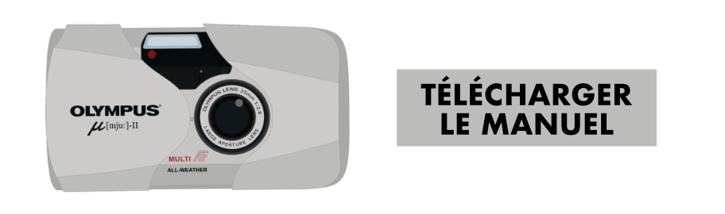

Il y a un peu moins d’un an, je faisais la revue de [l’Olympus XA](https://gregorymignard.com/olympus-xa/) que je présentais comme un excellent point & shoot qui ne me quittait jamais. Aujourd’hui, ce XA a été vendu et remplacé par un Olmypus mju:II, je vous explique tout ça.

Quand je me suis remis à la photo argentique, j’ai vite voulu investir dans un point & shoot pour avoir un appareil de poche que je puisse emmener partout avec moi. Je voulais vraiment quelque chose de compact et à l’époque, je souhaiter éviter l’électronique pour avoir un boitier fiable et rustique. Ce que j’avais mal mesuré, c’était mon rapport à la photographie avec un point & shoot. Je voulais vraiment quelque chose de simple et rapide à déclencher. Et ça, avec le XA, je ne l’avais pas.  
De passage chez mes parents au début de l’été, j’ai inconsciemment demandé s’ils n’avaient pas un petit compact argentique qui trainait. Ils avaient effectivement un petit Canon Prima Zoom65 que je leur ai piqué pour tester, mais je n’aime pas vraiment les appareils à zoom et je le trouvais encore gros par rapport à mon ancien XA. Il faut dire que les Yashica T4 et Olmypus mju:II me faisaient envie, je savais que c’était des appareils réputés, mais le prix me freinait un peu. Les vacances d’été approchant, j’ai finalement craqué pour un mju:II, revendu le XA et je suis parti sur les routes avec un nouveau point & shoot en poche avec de la [Portra 400](https://www.digit-photo.com/KODAK-Portra-400-135-36-Poses-X5-rKFILM386.html?dpa_id=23) et de [l’Ultramax](https://www.digit-photo.com/KODAK-Ultramax-400-135-36-Poses-X3-rKODAK41024389.html?dpa_id=23), le meilleur des tests.



### Olympus mju:II — Le meilleur appareil de poche ?

Sur le papier, l’Olympus μ[mju:]-II est assez proche de l’appareil photo de poche ultime. En pratique, c'est quasiment ça et c'est pourquoi il me suit désormais partout. Lancé en 1997, le mju:II s’impose clairement comme une version moderne de l’iconique Olympus XA. Facilité d’utilisation, objectif de 35mm, format compact qui tient dans une poche, tous les codes qui font le succès du XA sont présents sur le mju:II.  
Encore plus simple à utiliser, le mju:II dispose d’un autofocus à infrarouge et d’une gestion de l’exposition automatique. La sensibilité du film est identifiée par un codage DX et l’ouverture, la vitesse d’obturation et l’utilisation du flash sont gérées par l’appareil photo lui-même, le point & shoot par excellence !  
Olympus a même poussé le truc encore un peu plus loin en rendant cet Olympus mju:II étanche aux intempéries avec des joints en caoutchouc à la place des traditionnelles mousses. Il faut savoir que cet avantage est également un des défauts du Mju, les joints peuvent laisser passer quelques fuites de lumière en vieillissant et ne sont pas remplaçables.  
Très rapidement après son lancement, il a atteint un statut d’appareil culte qui se confirme régulièrement en voyant la hausse des prix du marché de l’occasion.











### À l’usage

La qualité de construction est excellente et l’électronique des années 90 est totalement opérationnelle dans mon cas. En parlant de fiabilité de l’électronique, j’ai également lu de nombreux témoignages à propos de mju:II qui rendent l’âme du jour au lendemain, mais c’est le risque à prendre quand on possède un appareil électronique vieux de plus de 20 ans.

L’utilisation est vraiment un jeu d’enfant. En plus du déclencheur, il n’y a que deux boutons pour contrôler l’appareil photo. Un pour basculer les modes flash et l’autre pour régler le retardateur. Il faut savoir que le flash sera toujours en auto en allumant l’appareil, il faudra donc penser à le désactiver si on veut vraiment déclencher sans flash. C’est une habitude à prendre, appuyer 2 fois de suite sur le bouton du flash pour le désactiver. En shootant majoritairement de la 400ASA, je me suis rendu compte qu’en mode auto, le flash ne se déclenche pas si souvent que ça.



> On dirait une version des années 1990 de l’appareil photo intégré à nos smartphones - vous le sortez de votre poche, vous cadrez et vous déclenchez avec d’excellents résultats dans la majorité des cas.

Le viseur est lumineux et clair. En plus d’une mire indiquant le point d’autofocus, il y a deux voyants informatifs sur le côté droit du viseur. Le vert indique que l’appareil a bien accroché une zone focus et le voyant orange nous indique si le flash sera utilisé ou non. Le chargement d’une pellicule est extrêmement facile. On insère un film, on plaque le début de la pellicule, puis on ferme le capot. Le Mju avance et se règle automatiquement sur la première pose.  
Contrairement à un appareil photo entièrement manuel, le mju:II fait un peu de bruit. C’est d’ailleurs souvent le cas dans la gamme des point & shoot. Déclencher provoque immédiatement un son lorsque l’objectif fait sa mise au point et avance la bobine d’une nouvelle pose. Une fois que vous avez terminé une pellicule, le rembobinage motorisé automatique dure un certain temps et n’est pas vraiment discret.











L’exposition automatique est très cohérente. Dans mon utilisation, toutes les photos sont bien exposées, même dans des conditions assez difficiles. Les seuls ratés que j’ai pu avoir étaient à cause d’une mise au point totalement à côté de la plaque, mais ça représente 2 images sur trois pellicules shootées dans l’été.

Malgré sa petite taille, l’appareil photo peut produire des images assez impressionnantes, même pour une personne non initiée à la photographie. C’est d’ailleurs un appareil que je peux prêter les yeux fermés pour faire une photo de famille ou capturer une scène. C’est simple, vous avez juste à cadrer et déclencher, c’est vraiment ce que j’attendais d’un point & shoot et que je n’avais pas avec l’Olympus XA.

### Alternatives à l’Olympus mju:II

Comme je l’ai dit précédemment, le mju:II a atteint un statut de culte et sa côte ne fait qu’augmenter au fil des ans. Il est proche d’un Yashica T4 en prix, mais beaucoup plus accessible que les cultissimes Contax T2, Nikon 35Ti et Ricoh GR. Comme tous les point & shoot de cette génération, l’Olympus mju:II sera moins fiable et durable qu’un appareil mécanique, mais c’est sans doute celui qui est le plus abordable parmi les appareils cultes.  

Finalement, le meilleur appareil photo de poche est celui que l’on a tout le temps dans sa poche et difficile de détrôner le smartphone qui excelle dans le domaine. En revanche, si vous souhaitez garder la nostalgie de la pellicule et l’amour du grain, l’Olympus mju:II sera sans doute le meilleur choix.

> Toutes les images de cet article ont été réalisées avec l’Olympus mju:II dans lequel j’ai chargé de la [Portra 400](https://www.digit-photo.com/KODAK-Portra-400-135-36-Poses-X5-rKFILM386.html?dpa_id=23) et de [l’Ultramax 400](https://www.digit-photo.com/KODAK-Ultramax-400-135-36-Poses-X3-rKODAK41024389.html?dpa_id=23).

*Pssss. Si tu veux en savoir encore un peu plus sur l’Olympus mju:II et lire un autre avis, mon pote [Jeremy](https://jeremyjanin.com/un-ete-avec-olympus-mju-ii/) partage également son coup de cœur pour le mju:II*
